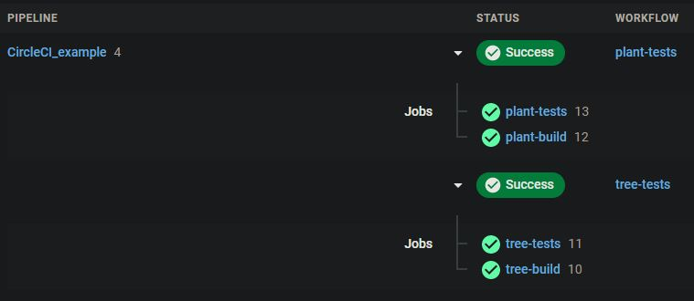

# CircleCI example

This repository aims to show how to use the continuous integration tool CircleCI to launch some database tests. The project example works with Go and PostgreSQL. First we have two Go services, Plant and Tree using PostgreSQL for database access. Pushing on the repository will trigger the CircleCI builds defined [here](./.circleci/config.yml).

## Technologies

- [CircleCI](https://circleci.com/) 
- [Go](https://golang.org/) 
- [PostgreSQL](https://www.postgresql.org/)

## Configure CircleCI

- Get to [CircleCI](https://circleci.com/) then Log In.
- Then, you can choose your code versionning, GitHub in the case of this example. 
- Next, on the "Projects" part, click on "Set Up Project" on the one you want to use with CircleCI.

Example of a success build :  

